# 📚 Library Management System

> Java Swing භාවිතයෙන් හදපු සම්පූර්ණ Library Management System එකක්. MySQL Database එකත් එක්ක සම්බන්ධ වෙලා වැඩ කරනවා.

---

## 🚀 Features

- ✅ **Member Management** - Add/Update/Delete Members
- ✅ **Book Management** - Add/Update/Delete Books
- ✅ **DVD Management** - Add/Update/Delete DVDs
- ✅ **Category Management** - Add/Update/Delete Categories
- ✅ **Author Management** - Add/Update/Delete Authors
- ✅ **Publisher Management** - Add/Update/Delete Publishers
- ✅ **Director Management** - Add/Update/Delete Directors
- ✅ **Issue Book** - Issue Books to Members
- ✅ **Issue DVD** - Issue DVDs to Members
- ✅ **Return Book** - Return Books with Fine Calculation
- ✅ **Return DVD** - Return DVDs with Fine Calculation

---

## 🛠️ Technologies Used

| Technology | Description |
|------------|-------------|
| **Java Swing** | GUI Development |
| **MySQL** | Database |
| **JDBC** | Database Connection |
| **XAMPP** | Local Server |

---

## 👤 Default Login

| Field | Value |
|-------|-------|
| **Username** | `Yashika` |
| **Password** | `123` |

---

## 📸 Screenshots

### 🔐 Login
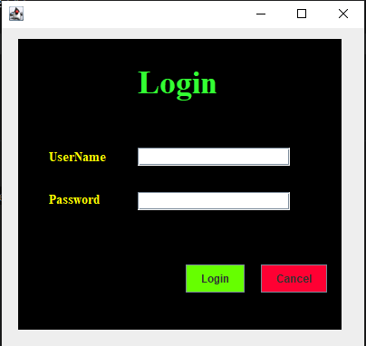

### 🏠 Main Menu
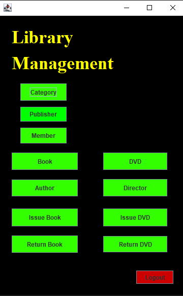

### 📂 Category Management
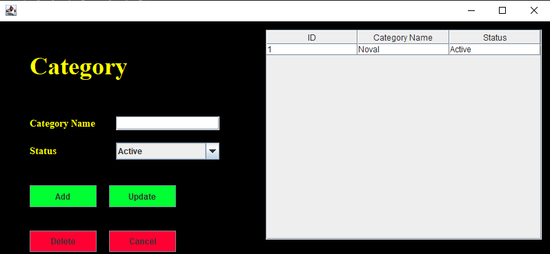

### ✍️ Author Management
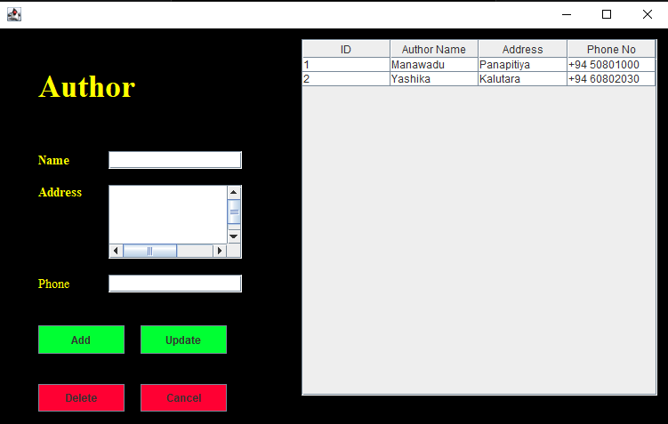

### 🏢 Publisher Management
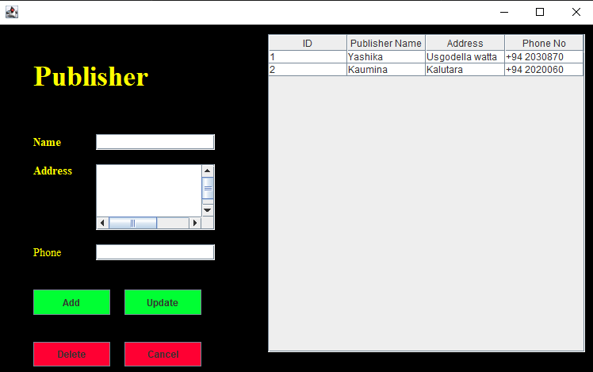

### 🎬 Director Management
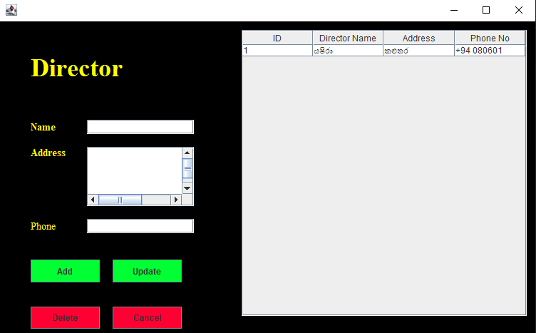

### 👤 Member Management


### 📖 Book Management
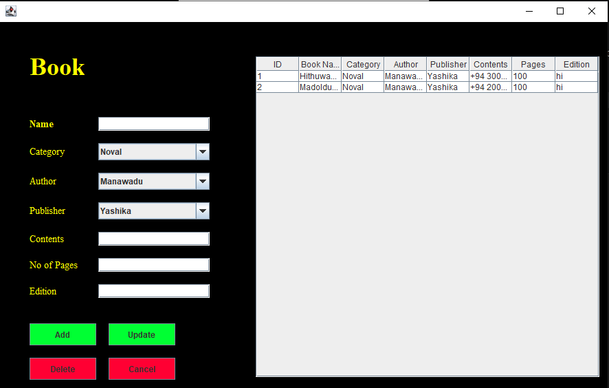

### 💿 DVD Management
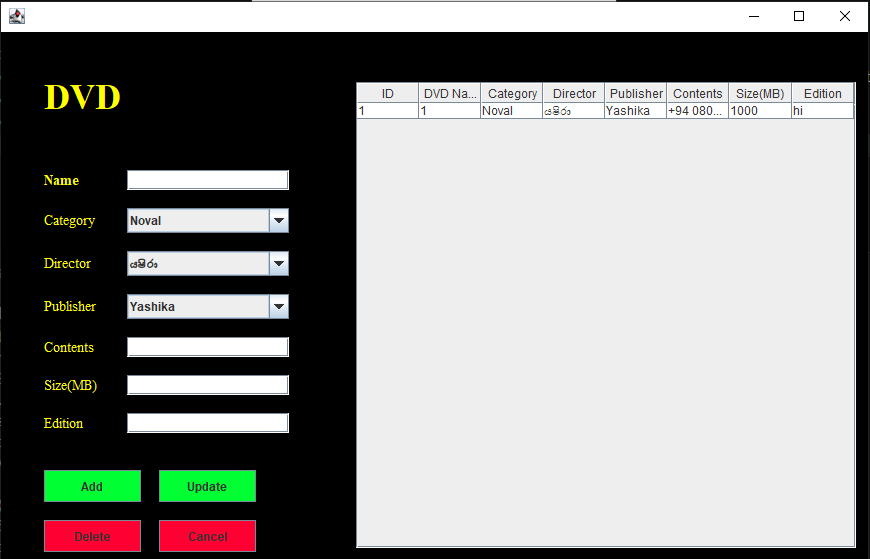

### 📤 Issue Book
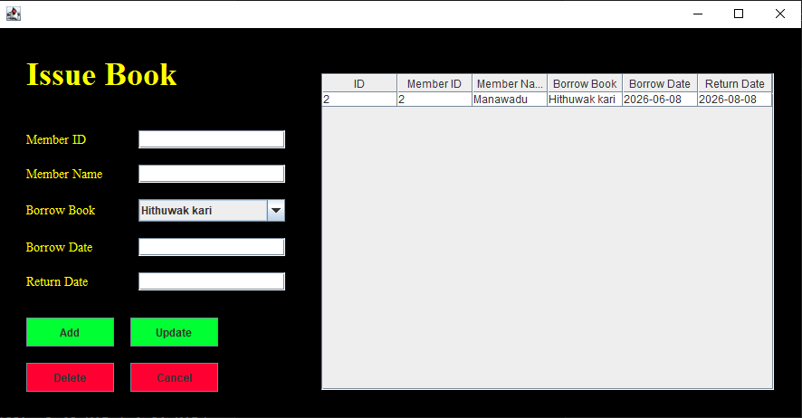

### 📤 Issue DVD
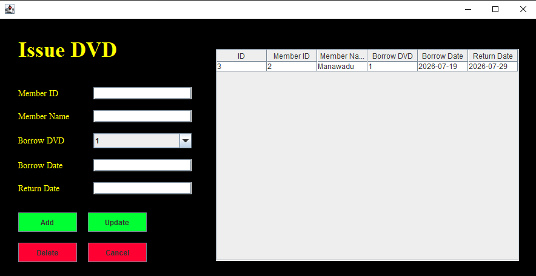

### 📥 Return Book
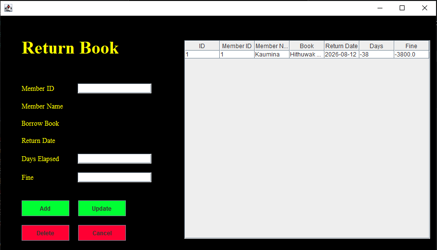

### 📥 Return DVD
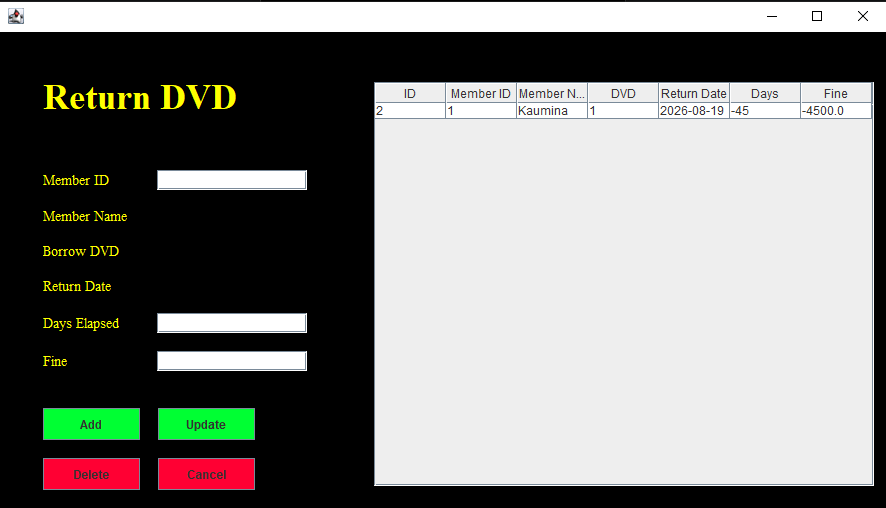

---

## 🔧 How to Run

### 1️⃣ Prerequisites
- Java JDK 8 or higher
- MySQL Server (XAMPP recommended)
- VS Code or any Java IDE

### 2️⃣ Database Setup
1. Open **XAMPP** and start **MySQL**
2. Create database:
```sql
CREATE DATABASE guilibrarynew;
